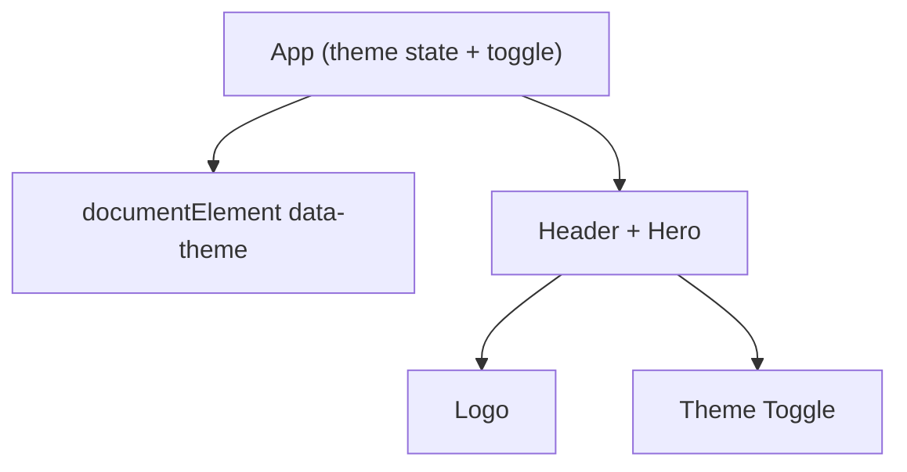

# Architecture

This document describes the structure of the Fresh Fruit Market React frontend (current workspace), including the app shell, theming, and the intended evolution toward a richer storefront with routing, contexts, and data access.

## Overview

The application is a single-page React app built with Create React App. It currently demonstrates:
- A theme-aware UI using CSS variables, supporting light/dark modes.
- A simple application shell rendering a header with an interactive theme toggle and a logo/link.

Global theming is applied by setting a data-theme attribute on the documentElement, allowing CSS variables to switch palettes without invasive changes to components.

## Application Shell

- src/App.js:
  - Manages the theme state (light/dark).
  - Applies the theme to document.documentElement via data-theme.
  - Renders a header with a theme toggle control, a React logo, and a link.

Layout:
- Header (within App.js): a simple full-screen hero layout with theme toggle, logo, and content.
- Main (future): product pages, cart, and checkout.
- Footer (future): simple footer with links and contact.

## Theming

- src/App.css defines CSS variables for both light and dark themes:
  - Light variables under :root.
  - Dark variables under [data-theme="dark"].
- The theme is toggled in App.js and persisted during the session via React state (persistence to localStorage can be added as needed).

## Routing (Planned)

The active workspace does not currently include routing. As functionality expands, adopt HashRouter to support static hosting without server-side route handling, with routes for:
- / — Home (catalog)
- /product/:id — Product details
- /cart — Cart
- /checkout — Checkout
- * — NotFound

## State Management (Planned)

Introduce React Contexts to manage global concerns:
- ThemeContext to expose theme state and toggle function, with localStorage persistence.
- CartContext to store items, provide operations, and compute derived totals.

## Data Access Layer (Planned)

Introduce a small API client reading environment variables to resolve the base URL with a timeout helper and mock fallbacks:
- Base URL precedence: REACT_APP_API_BASE, REACT_APP_BACKEND_URL, REACT_APP_FRONTEND_URL.
- Functions: fetchProducts, fetchProductById, submitCheckout with graceful mock fallback.

## Error Handling and Resilience (Planned)

- API client timeouts and mock fallbacks to protect UX when backend is misconfigured or down.
- Cart and theme persisted locally to survive reloads.

## Extensibility Notes

- When adding new pages, register them under HashRouter in App.js.
- For new data endpoints, add functions to a central api/client.js following the base URL and timeout pattern.
- Prefer extending contexts or creating new context providers for cross-cutting concerns.

## Diagram

