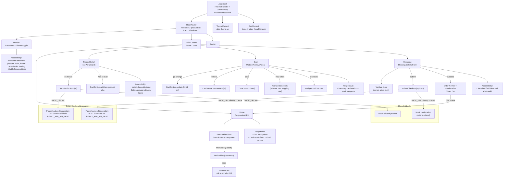

# Fresh Fruit Market - User Flow and Component Interaction Diagram

## Overview

This document presents a user journey and component interaction flow for the Fresh Fruit Market frontend. It reflects the current single-container React architecture using HashRouter, Theme and Cart contexts, and an API client with mock fallbacks. It also highlights where future backend integrations will occur via environment-driven base URLs (e.g., REACT_APP_API_BASE).

## Flow Diagram

## Narrative Summary

- The application mounts ThemeProvider and CartProvider around a HashRouter. Header and Footer are persistent; the main content switches between Home, ProductDetail, Cart, and Checkout via Route elements.
- On Home, users can browse a responsive product grid and refine the list through local search, filter, and sort. ProductCard links to the detail page using '/product/:id'.
- ProductDetail fetches the product by id. If REACT_APP_API_BASE (or fallback env) is not available or fails, a mock product is used. Users can set a quantity and add the item to the cart via CartContext.
- The Cart page allows updating quantities, removing items, clearing all items, and reviewing computed totals (subtotal, tax, shipping, total). Proceeding to Checkout routes to '/checkout'.
- Checkout validates basic shipping details on the client and submits the order via submitCheckout. When API envs are set, a future backend call will be made; otherwise, a mock confirmation is returned. On success, the cart is cleared and a confirmation screen is shown.
- Accessibility and responsiveness are baked in: semantic landmarks, aria-live for loading, visible focus, labeled inputs, and grid-based responsive layouts aligned with the Ocean Professional theme.

## Environment and Integration Notes

- The API client reads the base URL from REACT_APP_API_BASE (preferred) or REACT_APP_BACKEND_URL and falls back to mock data when unset or unreachable.
- Future backend endpoints:
  - GET /products and GET /products/:id for catalog and details.
  - POST /checkout for order submission.
- Additional environment variables available for broader control include REACT_APP_FRONTEND_URL, REACT_APP_WS_URL, REACT_APP_NODE_ENV, REACT_APP_ENABLE_SOURCE_MAPS, REACT_APP_PORT, REACT_APP_TRUST_PROXY, REACT_APP_LOG_LEVEL, REACT_APP_HEALTHCHECK_PATH, REACT_APP_FEATURE_FLAGS, and REACT_APP_EXPERIMENTS_ENABLED.

## Accessibility and Responsive Design Considerations

- Semantic structure uses header, main, and footer landmarks for clarity with screen readers.
- Loading states use aria-live to announce progress non-intrusively.
- Inputs and interactive controls have labels and visible focus outlines, improving keyboard navigation.
- Layouts adapt from single-column to multi-column grids; cards and summary panels reflow for smaller devices while maintaining readable tap targets and spacing.

