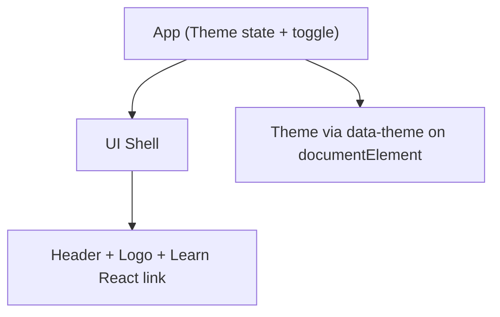

# Fresh Fruit Market — React Frontend

A React web frontend for an online fruit shop that lets users browse, search, and purchase fruits. The UI follows a modern, minimalist style with a subtle retro touch, aligned to the Ocean Professional palette (blue primary with amber accents). This repository currently contains only the frontend; a backend/API can be integrated later.

## Project Purpose and Scope

The goal of this frontend is to provide a delightful shopping experience for fresh fruits. Users can:
- Browse a curated catalog of fruits.
- Search and filter by name, description, or category.
- View product details and select quantities.
- Add items to a cart and proceed through a checkout flow.

This codebase is limited to the web UI. Network calls are abstracted via an API client that supports environment-driven base URLs and a robust mock fallback to allow local development without a backend.

## Current State and Roadmap

Current capabilities:
- Client-side UI shell with theme toggle.
- Theming with light/dark modes (persisted via data-theme attribute).
- Placeholder app scaffolding ready to expand into product/catalog/cart flows.

Planned next steps:
- Integrate the richer fruit shop implementation (routing, contexts, pages).
- Expand test coverage for components, contexts, and API client.
- Add product images/assets and refine accessibility labels.

## Architecture Overview

The current app is a Create React App-based single-page application. The UI is scaffolded with:
- App.js: manages theme state (light/dark), toggles theme, and renders a simple header with a React logo and link.
- App.css: defines CSS variables supporting light/dark themes via data-theme attribute on the documentElement.
- index.js/index.css: CRA standard bootstrap.

As the project evolves, adopt a structure similar to:
- Context providers for cross-cutting state (Theme, Cart) and localStorage persistence.
- HashRouter-based routing for static hosting environments.
- A minimal API client reading environment variables with mock fallbacks.

### Diagram



## Local Development Workflow

- Install dependencies and start the development server:
  - npm install
  - npm start
- The preview auto-starts on port 3000. Do not manually start additional processes in this environment; rely on the provided preview system.

Scripts:
- npm start — start the CRA dev server (react-scripts)
- npm test — run tests
- npm run build — production build

Linting:
- ESLint configuration exists (eslint.config.mjs) with React plugin and a no-unused-vars rule allowing React|App names.

## Environment Configuration

The app reads environment variables at build time (Create React App style). The broader Fresh Fruit Market project recognizes the following variables for this container:

- REACT_APP_API_BASE (preferred)
- REACT_APP_BACKEND_URL
- REACT_APP_FRONTEND_URL
- REACT_APP_WS_URL
- REACT_APP_NODE_ENV
- REACT_APP_NEXT_TELEMETRY_DISABLED
- REACT_APP_ENABLE_SOURCE_MAPS
- REACT_APP_PORT
- REACT_APP_TRUST_PROXY
- REACT_APP_LOG_LEVEL
- REACT_APP_HEALTHCHECK_PATH
- REACT_APP_FEATURE_FLAGS
- REACT_APP_EXPERIMENTS_ENABLED

Example .env:
```
REACT_APP_API_BASE=https://api.example.com
REACT_APP_WS_URL=wss://ws.example.com
REACT_APP_NODE_ENV=development
REACT_APP_ENABLE_SOURCE_MAPS=true
REACT_APP_PORT=3000
REACT_APP_LOG_LEVEL=info
REACT_APP_FEATURE_FLAGS=betaFilters,perfHints
REACT_APP_EXPERIMENTS_ENABLED=false
```

Notes:
- If no API base is configured or the backend is unreachable, future API client functions should fall back to mock data to keep local flows functional.

## Theming and Styling Guidance

CSS variables in src/App.css define the theme for light and dark modes. The app applies data-theme on documentElement to switch palettes.

Design guidance:
- Modern, clean aesthetic with subtle shadows, rounded corners, minimal ornamentation.
- Accent highlights on interactive elements; smooth transitions and subtle gradients for depth.
- Dark mode supported via [data-theme="dark"] overrides in App.css.

Usage:
- Prefer CSS variables for colors and text.
- Use semantic HTML and clear focus outlines for accessibility.
- Ensure sufficient color contrast (check WCAG AA/AAA where possible).

## Accessibility and Performance

Accessibility:
- Use semantic elements, aria-labels for interactive controls, and aria-live on loading states.
- Maintain visible focus states.

Performance:
- Keep component structures lean and avoid unnecessary re-renders.
- Prefer CSS for visual effects; leverage production builds for deployment.

## Testing Strategy (Initial)

- Unit tests with react-scripts and testing-library/jest-dom (see src/setupTests.js).
- Current sample test: App renders the “learn react” link.

Run tests:
- npm test

## Deployment Considerations

- This is a static React app built with Create React App.
- Use npm run build to produce optimized assets under build/.
- Configure environment variables at build time; CRA inlines REACT_APP_* variables only.

## Contribution Guidelines and Code Quality

- Follow the established style: React functional components and hooks.
- Keep components small and focused; co-locate component-specific styles.
- Ensure ESLint passes and include/update tests as appropriate.
- Adhere to the Ocean Professional palette and modern/retro style cues.

Quick links:
- Architecture details: ARCHITECTURE.md
- Environment configuration: ENVIRONMENT.md
- Development workflows: DEVELOPMENT.md
- Style guidance: STYLE_GUIDE.md
- Contribution workflow: CONTRIBUTING.md
